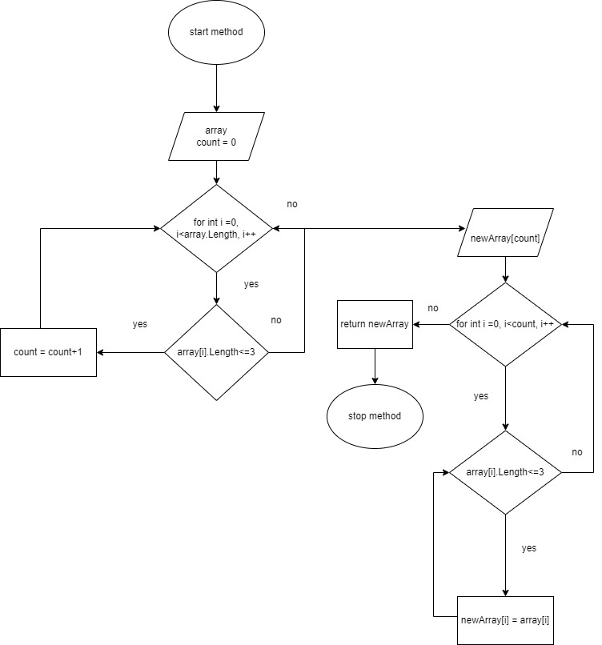

Этапы выполнения программы:
1) Пользователь вводит поэтапно все элементы начального массива через
формат string
2) Полученный массив выводится на экран
3) Далее идет подсчет элементов в изначальном массиве, длина
которых не превышает 3-х знаков. По их кол-ву создается
второй массив и заполняется этими элементами
4) Второй массив выводится на экран
